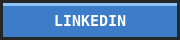
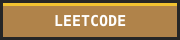
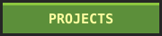
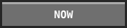
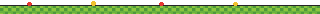
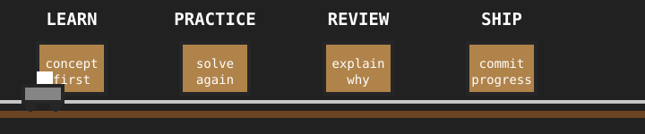
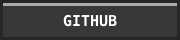
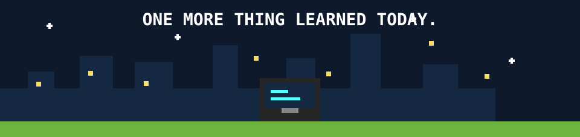

<!--
  Profile README for github.com/IamDavidLe
  Visual language inspired by DOCKET (MIT licensed):
  github.com/k1lst1x/DOCKET — Copyright (c) 2026 saint
-->

### Computer science student and undergraduate researcher in San Francisco. Building secure, thoughtful systems one project at a time.

  

  

▲ My hotbar: research, machine learning, systems, algorithms, tools, practice, stats, and ways to connect.

 

> [!NOTE]
> I’m **David Le**, a B.S. student in Computer Science, Statistics, and Machine Learning at San Francisco Bay University. I’m an undergraduate researcher exploring vision-language model security and unlearning, and I use this space to document the work I build and learn from.

<b>📜 Table of contents</b>

 

| | | |
| --- | --- | --- |
| 🌲 [Spawn point](#spawn-point) | 🎒 [Inventory](#inventory) | ⚒️ [Crafting table](#crafting-table) |
| 🧰 [Tech stack](#tech-stack) | 🟩 [Quest log](#quest-log) | 📊 [LeetCode stats](#leetcode-stats) |
| 🧭 [Connect](#connect) |  |  |

## 🌲 Spawn point

I’m a computer science student and undergraduate researcher focused on machine learning, model security, and practical software engineering. I like difficult problems that reward careful investigation, clear implementation, and iteration.

<table>
<tr>
<th width="50%">🔬 Current research</th>
<th width="50%">🛠️ Engineering approach</th>
</tr>
<tr>
<td>

- Vision-language model security and unlearning
- Vision Transformer intermediate representations
- Biometric and adversarial-patch information in visual models

</td>
<td>

- Extract and analyze model representations with PyTorch
- Prototype, test, troubleshoot, and improve iteratively
- Prefer readable, maintainable implementations

</td>
</tr>
</table>

## 🎒 Inventory

> A few items currently in my chest: public problem-solving work, applied research, and hands-on engineering projects.

<table>
<tr>
<td width="50%" valign="top">
 
<b>NeetCode submissions</b> · <code>Python</code> 
A public collection of problem-solving practice, built around the NeetCode roadmap.  
<a href="https://github.com/IamDavidLe/neetcode-submissions">Explore the repository →</a>
</td>
<td width="50%" valign="top">
 
<b>LeetCode problems</b> · <code>Python</code> 
Algorithm and data-structure exercises, worked through as part of an ongoing learning practice.  
<a href="https://github.com/IamDavidLe/Leetcode_problem">Explore the repository →</a>
</td>
</tr>
<tr>
<td width="50%" valign="top">
 
<b>Vision-language model security &amp; unlearning</b> · <code>PyTorch</code> 
Undergraduate research investigating how sensitive visual information is represented across transformer-based vision models.
</td>
<td width="50%" valign="top">
 
<b>Solar-powered vehicle</b> · <code>Arduino/C++</code> 
Designed, programmed, tested, and debugged a solar-powered vehicle with sensors, motor control, and electrical systems.
</td>
</tr>
</table>

## ⚒️ Crafting table

<table>
<tr>
<th width="33%">🪵 Explore</th>
<th width="33%">🧱 Build</th>
<th width="33%">⚙️ Improve</th>
</tr>
<tr>
<td valign="top">Start with the model, the data, and the question that needs an answer.</td>
<td valign="top">Write small, readable implementations that make the reasoning visible.</td>
<td valign="top">Test, troubleshoot, and document what the next iteration should do better.</td>
</tr>
</table>

## 🟩 Quest log

I’m currently strengthening the fundamentals that compound: Python, C++, SQL, data structures and algorithms, while applying PyTorch and transformer-based vision models in undergraduate research.

## 🧰 Tech stack · My tools

| Slot | Item | What it supports |
| --- | --- | --- |
| 🐍 | **Python, C++, Arduino/C++, SQL** | Core programming, embedded development, and data work |
| 🧩 | **Data structures, algorithms, OOP** | Clear decomposition and efficient, maintainable solutions |
| 🧠 | **PyTorch, TensorFlow, scikit-learn** | Machine-learning and vision-model experimentation |
| 📊 | **NumPy, Pandas, Matplotlib** | Data analysis, manipulation, and visualization |
| 🧰 | **Git, GitHub, VS Code** | Version control, collaboration, and daily development |
| 📖 | **NeetCode & LeetCode** | Deliberate, repeatable technical practice |

## 📊 LeetCode stats

Live problem-solving totals and 52-week submission activity, sourced from my LeetCode profile.

## 🧭 Connect

Keep learning. Keep building. Keep the commit history honest.

